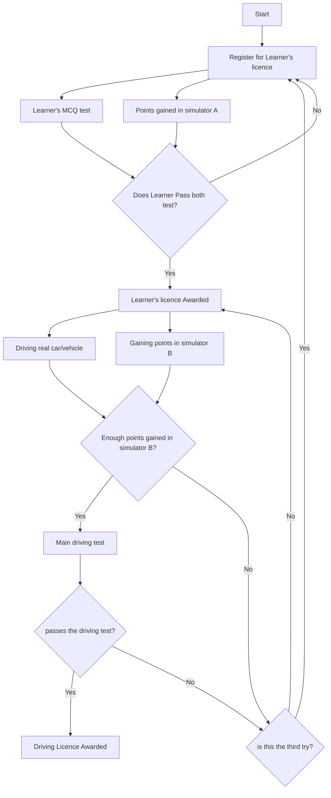

### DRIVING LICENCE PROCESS

---

### SIMULATOR A 
- mobile app based
- aim is to teach about road signs and judge candidate on real-life situations (based on choice made on road)
- rather than objective type questions, situation based questions need to be asked. like what would you do it this or this happens.
- since judging on the subjective answer without human bias is not possible, AI might be used to judge these answers.
- several hours must be invested in this simulator to gain enough points for getting eligible for Learner's licence

---
### SIMULATOR B
- realistic simulator located in driving schools, which generate random maps and obstacles to test the real-world driving skills of the candidate. since all possible scenarios are not possible in city-driving, this simulator simulates then easily.
- candidate can be trained in areas and situations in which he/she struggles the most.
- this test can easily judge the driving style of the candidate and give points or penalties accordingly.
- several trips on different days must be completed to complete the required points on the simulator

---
